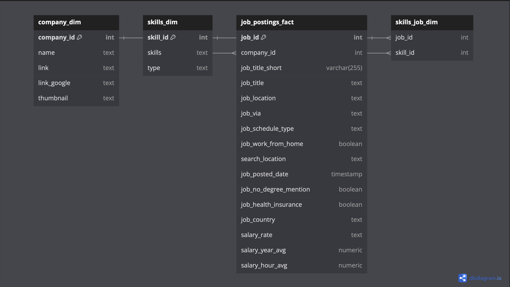

# Data Scientist & Data Analyst Job Market Analysis

## Overview

This project was inspired by [Luke Barousse's](https://github.com/lukebarousse/SQL_Project_Data_Job_Analysis) SQL project which analyzes job market trends for **Data Analyst** roles using real job posting data. It aims to identify top-paying roles, in-demand skills, and how specific skills impact salary levels, guiding you toward optimal skills for career advancement. I have toilered my findings to analyze **Data Scientist** roles on top of **Data Analyst** positions. The full SQL queries can be located [here](queries/). The exported datasets can also be found [here](datasets/).

## Objectives and Queries

1. **Top-Paying Data Scientist Jobs:** Identify the 15 highest-paying roles and their locations.
  
2. **Required Skills for Top Jobs:** Analyze specific skills needed for these positions.

3. **In-Demand Skills (SHOWCASE):** Determine the top 7 skills currently sought in the job market.

4. **Salary Impact by Skill:** Examine average salaries linked to various skills.

5. **Optimal Skills to Learn (SHOWCASE):** Identify high-demand skills associated with strong salary potential.

## Database Schema


## In-Demand Skills

```sql
SELECT
    skills,
    COUNT(skills_job_dim.job_id) AS demand_count
FROM job_postings_fact
INNER JOIN skills_job_dim ON job_postings_fact.job_id = skills_job_dim.job_id
INNER JOIN skills_dim ON skills_job_dim.skill_id = skills_dim.skill_id
WHERE
    job_title_short = 'Data Scientist'
GROUP BY
    1
ORDER BY
    2 DESC
LIMIT 7
```
### Breakdown of In-Demand Skills to Learn for Data Scientists

The following table highlights the top skills sought after in job postings for Data Scientist positions:

| Skill     | Demand Count |
|-----------|--------------|
| Python    | 114,016      |
| SQL       | 79,174       |
| R         | 59,754       |
| SAS       | 29,642       |
| Tableau    | 29,513       |
| AWS       | 26,311       |
| Spark     | 24,353       |

1. **Fundamental Skills:** Python and SQL are paramount, underscoring the necessity for solid foundational skills in data manipulation and analysis.

2. **Statistical Analysis with R:** R programming ranks third, with a demand count of 59,754. This position highlights its significance in statistical analysis and advanced data visualization. While R excels in specialized statistical applications and research-oriented tasks, its usage might be more prevalent in specific sectors, such as academia or specialized analytics firms, rather than across the board in general data science roles.

3. **Data Visualization Tools:** Tableau remains essential for data visualization, while AWS and Spark are increasingly vital for cloud computing and big data processing, reflecting the growing importance of technical expertise in these areas.

4. **Emerging Technologies:** The inclusion of AWS and Spark in the top demanded skills indicates a shift towards cloud computing and big data technologies, which are becoming critical for modern data science workflows.

Focusing on these skills can enhance job security and open up better financial opportunities, especially in high-demand locations.


## Optimal Skills to Learn 

```sql
WITH skills_demand AS (
    SELECT
        skills_dim.skill_id,
        skills_dim.skills,
        COUNT(skills_job_dim.job_id) AS demand_count
    FROM job_postings_fact
    INNER JOIN skills_job_dim ON job_postings_fact.job_id = skills_job_dim.job_id
    INNER JOIN skills_dim ON skills_job_dim.skill_id = skills_dim.skill_id
    WHERE
        job_title_short = 'Data Scientist'
        AND salary_year_avg IS NOT NULL
        AND (
            job_location LIKE '%, CA' OR
            job_location LIKE '%, WA' OR
            job_location LIKE '%, NY' OR
            job_location LIKE '%, DC'
        )
    GROUP BY
        skills_dim.skill_id
    LIMIT 10
),

average_salary AS (
    SELECT
        skills_job_dim.skill_id,
        ROUND(AVG(salary_year_avg), 0) as avg_salary
    FROM job_postings_fact
    INNER JOIN skills_job_dim ON job_postings_fact.job_id = skills_job_dim.job_id
    INNER JOIN skills_dim ON skills_job_dim.skill_id = skills_dim.skill_id
    WHERE
        job_title_short = 'Data Scientist'
        AND salary_year_avg IS NOT NULL
        AND (
            job_location LIKE '%, CA' OR
            job_location LIKE '%, WA' OR
            job_location LIKE '%, NY' OR
            job_location LIKE '%, DC'
        )
    GROUP BY
        skills_job_dim.skill_id
)
SELECT
    skills_demand.skill_id,
    skills_demand.skills,
    demand_count,
    avg_salary
FROM
    skills_demand
INNER JOIN average_salary ON skills_demand.skill_id = average_salary.skill_id
ORDER BY
    demand_count DESC,
    avg_salary DESC
```
### Breakdown of Optimal Skills to Learn for Data Scientists

The following table summarizes the skills that are currently in high demand among Data Scientist job postings, along with their corresponding demand counts and average salaries:

| Skill        | Demand Count | Average Salary |
|--------------|--------------|----------------|
| Python       | 1,001        | $160,862       |
| SQL          | 766          | $163,071       |
| R            | 605          | $160,652       |
| SAS          | 89           | $133,192       |
| Java         | 82           | $152,545       |
| Go           | 75           | $171,646       |
| Scala        | 69           | $191,503       |
| JavaScript   | 29           | $128,260       |
| NoSQL        | 24           | $165,460       |
| Shell        | 11           | $149,258       |

1. **Top Programming Skills:** Python and SQL lead the demand, emphasizing their critical role in data manipulation and analysis. Both skills command high average salaries, indicating their value in the job market.

2. **Statistical Tools and Languages:** R and SAS are important for statistical analysis and data modeling. R maintains a strong demand alongside Python, showcasing its relevance in data science, especially in academia and specialized industries.

3. **Emerging Languages:** Go and Scala are notable for their growing demand and high average salaries, reflecting trends toward modern programming languages in data processing and big data applications.

4. **Specialized Skills:** Java, NoSQL, and Shell scripting also hold value, with Java being crucial for software development and NoSQL for handling non-relational databases, while Shell scripting remains essential for automation and system administration tasks.

5. **Job Security and Financial Benefits:** Focusing on these skills can lead to better job security and higher financial rewards, particularly in high-demand locations where competition for Data Science roles is robust.


## Conclusion

This analysis highlights key trends in the Data Scientist job market, focusing on in-demand skills and salary potential. Mastering foundational skills like Python and SQL, alongside emerging technologies such as Go and Scala, is essential for career advancement. By focusing on these skills, individuals can enhance their job security and financial prospects in the evolving data science field.

## Acknowledgments

I would like to express my gratitude to **Luke Barousse** for his invaluable guidance throughout this project. His comprehensive project guidelines and datasets greatly contributed to the success of this analysis. 

You can access his detailed 4-hour YouTube guide on this project [here](https://www.youtube.com/watch?v=7mz73uXD9DA). Additionally, his version of the project is available on GitHub [here](https://github.com/lukebarousse/SQL_Project_Data_Job_Analysis).

